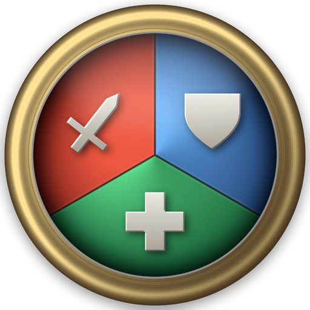
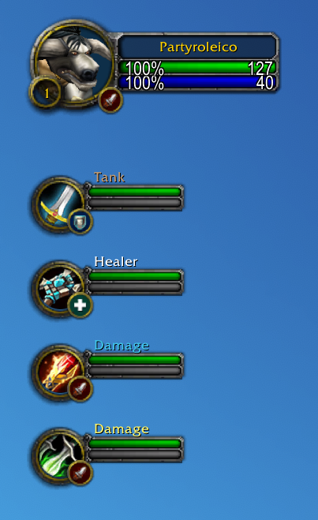

<p align="center">
  
</p>

<h1 align="center">Party Role Icons</h1>

<p align="center">
  Tank, healer and damage icons on your party portraits, the way retail does it.
</p>

## Download

- **[CurseForge](https://www.curseforge.com/wow/addons/party-role-icons-display-group-roles)**
- **[Latest release](https://github.com/Mouchoir/PartyRoleIcons/releases/latest)** - grab the zip and drop the `PartyRoleIcons` folder into `Interface\AddOns`.

## What it does

Four druids in your dungeon group. Good luck telling which one is tanking, which
one is healing, and which two are just here to hit things.

This addon puts the icon back, in that order of preference:

1. **The assigned role**, whenever there is one. Free, instant, always right.
2. **The specialization**, when there is not. Resolved through a throttled
   inspect and remembered per character.
3. **The class**, for hunters, mages, rogues and warlocks. They have no tank or
   healer spec, so those four never cost an inspect at all.

And a role worked out from a spec is treated as what it is: a guess. The moment
the group assigns roles, a role check before queueing for instance, the icon
switches to what the player actually picked. That happens even if the client
never sends the event, because a guessed role keeps a slow re-check armed until
the real answer turns up.

## Setting it up without a group

<p align="center">
  
</p>

Type `/pri`, or find **Party Role Icons** in the game's options, and tick
**Simulate a group**. The empty party slots fill with a plausible five man, as
above: a warrior tank, a priest healer, a mage and a rogue, class portraits and
role names included. Drag the sliders and the icons move while you watch.

Position is a three by three keypad of the nine anchor points around the
portrait, so you click the corner you want instead of guessing what
`BOTTOMRIGHT` will look like.

## Why other role icon addons come up empty on 5.5

Two client details, both of them silent. If you tried another addon and got a
blank party or a strange cropped blob, this is why.

**The party frames moved.** MoP Classic ships the modern layout: the frames live
in `PartyFrame.MemberFrame1` through `4`, handed out by a frame pool. The old
`PartyMemberFrame1` globals are gone. An addon that only looks those up finds
nothing, attaches nothing, and has nothing to complain about. Your own portrait
keeps working, since `PlayerFrame` is still a global, which makes the whole thing
look like a half broken addon rather than a missing frame. This one resolves the
frames at runtime and handles the modern layout, the frame pool, and the legacy
globals.

**The role artwork has two coordinate spaces.** `UI-LFG-ICON-ROLES` is a 256
pixel sheet, and the helper everyone reaches for, the venerable
`GetTexCoordsForRoleSmallCircle`, still hands back coordinates from the 64 pixel
era. Feed it those and you slice a corner out of an icon, which is exactly the
little truncated square you may have seen on your own portrait.

## Commands

Everything lives in the panel, and everything also has a command.

| Command | Effect |
| --- | --- |
| `/pri` | open the options panel |
| `/pri on` · `/pri off` | turn the icons on or off |
| `/pri player` | show or hide the icon on your own portrait |
| `/pri spec` | use the specialization when no role was assigned |
| `/pri size 8-40` | icon size in pixels |
| `/pri x N` · `/pri y N` | nudge the icon |
| `/pri anchor POINT` | which corner of the portrait it hangs on |
| `/pri blizzard` | hide Blizzard's own role icon |
| `/pri test` | dress up the empty party frames to set things up solo |
| `/pri reset` | back to defaults |
| `/pri debug` | dump everything the addon can see |

`/partyroleicons` works as a longer alias.

## Where it works

| Client | The role comes from |
| --- | --- |
| **MoP Classic** | the assigned role, then the specialization |
| **Classic Era**, Hardcore, Season of Discovery | talent trees, since Era has neither roles nor specializations |

Hardcore and Season of Discovery are realm rulesets on the Era client rather than
separate flavours, so one build covers all three. Retail is not a target: it
already draws these icons itself.

On Era the role is read from whichever talent tree got the points, matched by tab
index rather than by name so it works in any language. Feral Combat is the one
tree nothing can settle, bear and cat being the same tree, so a feral druid shows
up as damage.

## Good to know

- It draws on the **default Blizzard unit frames**. ElvUI, Z-Perl and friends
  replace those with their own and have their own role indicator option, so use
  theirs instead.
- With **raid style party frames** on, Blizzard already draws role icons there
  and this addon has nothing to attach to.
- Icons only show **while grouped**, like retail. That is what the simulation is
  for.
- **Distance only matters for the specialization path.** An assigned role is read
  straight off the roster, so in a dungeon group nobody has to stand next to you.
  It is only the hand made group with no roles assigned that needs an inspect,
  and there a member who is out of range stays blank until they come back.
- Something looks off? `/pri debug` prints what the addon sees, frame by frame.
  That output is the ideal thing to paste into an issue.

## My other addons

If this one earns a place in your `AddOns` folder, you might like the rest.

**[Timeless Question Autocomplete](https://github.com/Mouchoir/Timeless-Question-Autocomplete)**
Senior Historian Evelyna asks you a lore question every day on the Timeless Isle.
This answers it, in any game language.
[CurseForge](https://www.curseforge.com/wow/addons/timeless-question-autocomplete)

**[Darkmoon Faire Buff](https://github.com/Mouchoir/DarkmoonFaireBuff)**
Sayge's buff is four dialogue clicks and one wrong turn away from the buff you
actually wanted. Pick yours once, then just talk to him. It can also recommend
one from your class, level and talents, and it tracks the cooldown.
[CurseForge](https://www.curseforge.com/wow/addons/darkmoon-faire-buff-dfb)

**[Hardcore Congrats](https://github.com/Mouchoir/HardcoreCongrats)**
Level 60 in Hardcore is a long and perilous road. When someone on your realm
finally gets there, this congratulates them for you.
[CurseForge](https://www.curseforge.com/wow/addons/hardcore-congrats)

## Development

The addon itself is `addon/PartyRoleIcons/`. Everything around it is there to
make changes safe:

```powershell
.\scripts\dev.ps1              # mirror the addon into every WoW flavour you have
.\scripts\build.ps1            # zip it into dist/
python scripts\make_icon.py    # redraw the logo and the addon list icon
```

`scripts\dev.ps1` finds a standard Battle.net install on its own. For anything
else, pass `-WowAddOnsPath`, set `PRI_WOW_ADDONS_PATH`, or drop a gitignored
`scripts\dev.local.ps1` setting `$WowAddOnsPaths`.

```bash
npm install
npm test
```

The tests run the shipped Lua in a real Lua VM against a mock WoW client, so the
role resolution, the inspect queue, the simulation, the options panel and every
command can be checked without launching the game. The suite runs six times: once
per party frame layout, because guessing that wrong is what makes the icons
silently vanish, once in French, and twice on the Classic Era role engine, one run
per `GetTalentTabInfo` return layout.
